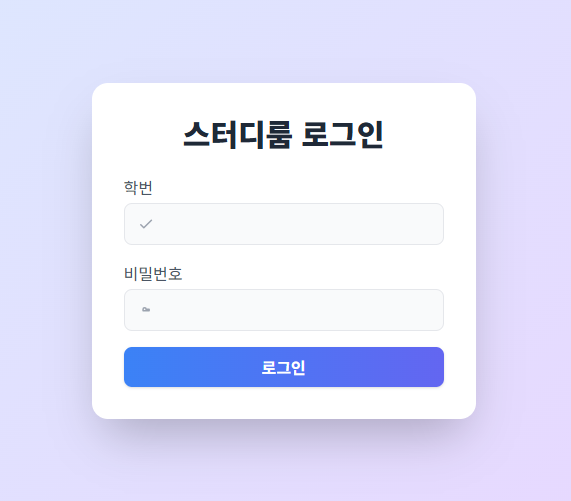
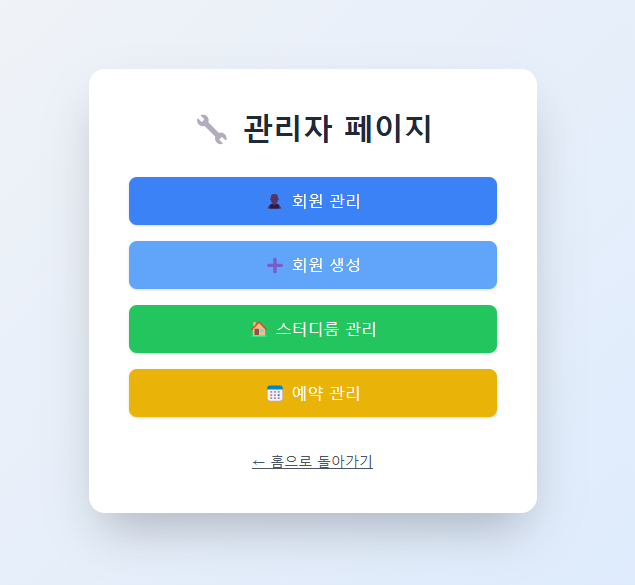
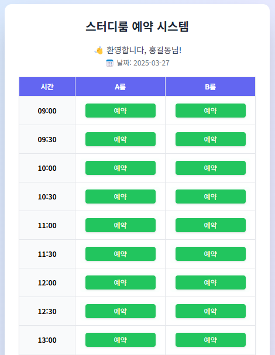
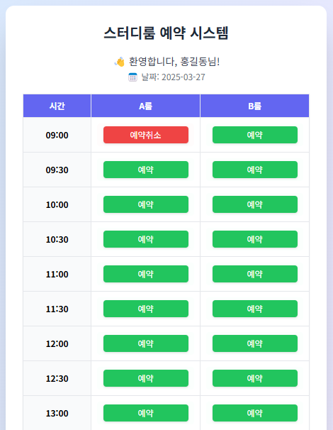
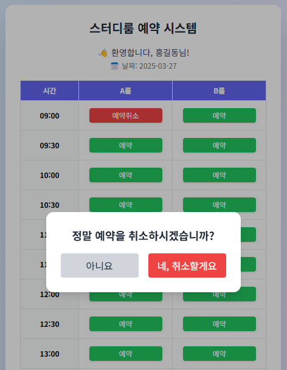

# 📚 스터디룸 예약 시스템

스터디룸을 효율적으로 예약하고 관리할 수 있는 웹 애플리케이션입니다.  
사용자는 실시간으로 스터디룸의 예약 현황을 확인하고, 원하는 시간대에 예약할 수 있습니다.  
관리자는 전체 예약 현황을 관리할 수 있으며, 유저 관리 및 시간표 설정도 가능합니다.

스프링 공부할 겸 간단히 만들어보는 토이프로젝트!

---

## 🛠 기술 스택

### 💻 Back-End
- Java 17
- Spring Boot
- Spring MVC
- Spring Data JPA
- Spring Security (로그인 기능)
- Thymeleaf (템플릿 엔진)

### 🎨 Front-End
- HTML/CSS
- Tailwind CSS
- Thymeleaf 템플릿

---

## ✨ 주요 기능

### 사용자 기능
- ✅ 스터디룸 예약하기
- ✅ 예약 확인 및 본인 예약 취소
- ✅ 실시간 예약 상태 확인

### 관리자 기능
- 🔒 관리자 로그인
- 🗂 예약 현황 관리
- 📅 타임슬롯 관리
- 👥 사용자 관리 (선택사항)

### 추가할 기능
- 예약 현황 자세히 표시
- 예약 범위 제한 ( 연속으로 예약 / 최대 예약 시간 )
- 관리자일 경우 관리자 페이지로 돌아갈 수 있도록 수정
- 관리자 페이지 현황 날짜 별로 볼 수 있도록 수정
- DB 성능 개선
---

## 🖼️ 화면 예시

### 🔐 로그인 페이지

---
### ⚙️ 관리자 페이지

---
### 🏠 기본 홈 화면 (예약 없음)

---

### 📅 예약이 있는 홈 화면

---

### ❌ 예약 취소 화면 (본인 예약 시)

---

